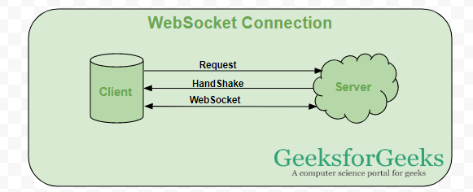

# ft_transcendence

## Project Structure & Workflow

- **Created the folder structure for the project**  
- **Installed the environment for the backend (DRF)**  
- **Designed authentication (Sign In & Sign Up)**  
- **Implemented the frontend design with React.js**  
- **Learning more about JWT in Django Rest Framework for implementing backend authentication**  
- **To-do: Design more frames for the project**

## DRF

### **Model (Database Layer)**
A model in Django (or DRF) represents the structure of your data and the tables in the database. Think of a model as a blueprint for creating objects that are stored in a database.  
For example:  
- **Fields**: `name`, `email`, `address`
- **Data types**: `text`, `integer`, `date`

### **View (Logic Layer)**
A view in DRF handles the logic of what happens when a user makes a request (GET, POST, etc.) to a specific URL. It defines what happens when a user submits data.  
Think of it as a **clerk at the library** who processes requests from customers (users).

### **URL (Routing Layer)**
A URL is the address or path that someone visits to access a specific view.  
For example, `/api/books/` would return a list of books if the server is set up to return data at that URL.

### **JWT Authentication Flow**
**JWT (JSON Web Tokens)** are used for secure communication between the client and server. Here’s the basic flow:

1. **User logs in** through a React login form.
2. **React sends a POST request** with the username and password to `/api/login`.
3. **Server generates a token** after successful authentication.
4. **Token is returned** to the frontend with a success message.
5. **Frontend stores the token** (e.g., in the state).
6. **For any future request**, the frontend sends the token in the HTTP headers.

---

## OAuth
OAuth allows secure third-party access to user data **without exposing passwords**.  
It involves these steps:
1. **User requests access** to a third-party service (e.g., Google).
2. **Authorization code is issued**, which is then used by the backend to get an access token.

### How OAuth Works:
- **Library**: 42 API (The third-party service where user data is stored)
- **Library Card**: The authorization code given to the user.
- **Reception**: The backend that verifies the authorization code.
- **Book**: The access token returned to the user.

---

## **Friendship Module**

### **Database Relationships**  
- **Many to Many**: A user can have many friends, and each friend can be a friend of many users.
- **One to Many**: A teacher can have many students, but each student has only one teacher.
- **One to One**: A person can have only one passport.

### **Key Concepts:**

- **Foreign Key (FK)**: A foreign key connects one table’s primary key to another table, establishing a relationship between the two tables.
- **Primary Key (PK)**: A primary key uniquely identifies each row in a table.

#### **Example Relationships:**

- **friendships_initiated**: List of users that you have sent friend requests to.
- **friendships_received**: List of users who have sent you friend requests.

---

## **WebSockets and Real-time Communication**
WebSockets are used to create **persistent, two-way connections** between the client and server, allowing real-time communication.  
For example:
- **Django Channels** enables this functionality, improving interaction without needing to refresh the page or open multiple connections.

---

## **Two-Factor Authentication (2FA)**  
2FA is an additional layer of security where the user’s device (like a phone with Google Authenticator) generates a time-based code (TOTP) to verify identity.  
- **pyotp.random_base32()** generates a random base32 string for the shared secret.

---

## **File Storage: Static vs. Media**

1. **Static Directory**: Stores files that do not change, like images, CSS, and JavaScript.
2. **Media Directory**: Stores user-generated files like profile pictures, QR codes, etc.

---

## **Password Hashing (PBKDF2)**  
Django’s `set_password()` method uses the PBKDF2 algorithm to hash passwords.  
- The hash format is: `algorithm$iterations$salt$hash`

---

**About the 2FA**

* The TOTP algorithm requires a shared secret key between the server and the user's device (often their phone with an authenticator app like Google Authenticator or Authy). This shared secret key is a unique identifier for generating the 2FA codes.

* pyotp.random_base32() creates this random secret key in base32 encoding, which is compatible with most 2FA apps.
* The generated string looks random, e.g., JBSWY3DPEHPK3PXP.
* This key will be stored on the server and shared with the user (usually via a QR code). Once stored, both the server and the user's authenticator app will   generate matching codes based on this key.  

**For storing dynamically** 

1. static directory:

* Stores files that are part of your app itself, like JavaScript, CSS, and images used for design  (logos, icons, etc.).
* These files don’t change per user and are typically version-controlled because they are a core part of your app.
* Configured with STATIC_URL and STATICFILES_DIRS.  

2. media directory:  

* Stores user-generated or dynamic content, like profile pictures or QR codes generated for * specific users.  
* These files change depending on user actions or content and aren’t typically tracked by   versioncontrol.
* Configured with MEDIA_URL and MEDIA_ROOT.  

-> REMOTE GAME INSTRUCTIONS

**SET_PASSWORD() ALGORITHM**

* Django's set_password() uses the PBKDF2 (Password-Based Key Derivation Function 2) algorithm by default, with SHA256 as the hash function. It:
* Generates a random salt
* Performs multiple iterations (default: 600,000 in recent Django versions)
* Combines password with salt
* Produces a 256-bit derived key
* The final stored password format is: <algorithm>$<iterations>$<salt>$<hash>
* You can customize the algorithm and iterations in Django settings with PASSWORD_HASHERS and PASSWORD_HASHER_OPTIONS.

**This creates an AI opponent that:**

* Only moves when the ball is moving towards it
* Updates its position every second
* Has a slight delay in tracking the ball
* Stays within the game boundaries
* Tries to center itself on the ball's position
